## Android Studio的使用技巧

本文介绍Andoird Studio中的部分快捷键以及部分常用插件

<!--more-->

[Android Studio中setting中的常见配置](https://blog.csdn.net/m0_37711172/article/details/79752366?utm_medium=distribute.pc_relevant.none-task-blog-searchFromBaidu-3.control&depth_1-utm_source=distribute.pc_relevant.none-task-blog-searchFromBaidu-3.control)

### 常用的快捷键

#### 双击shift：全局搜索

**搜索包括Android SDK**

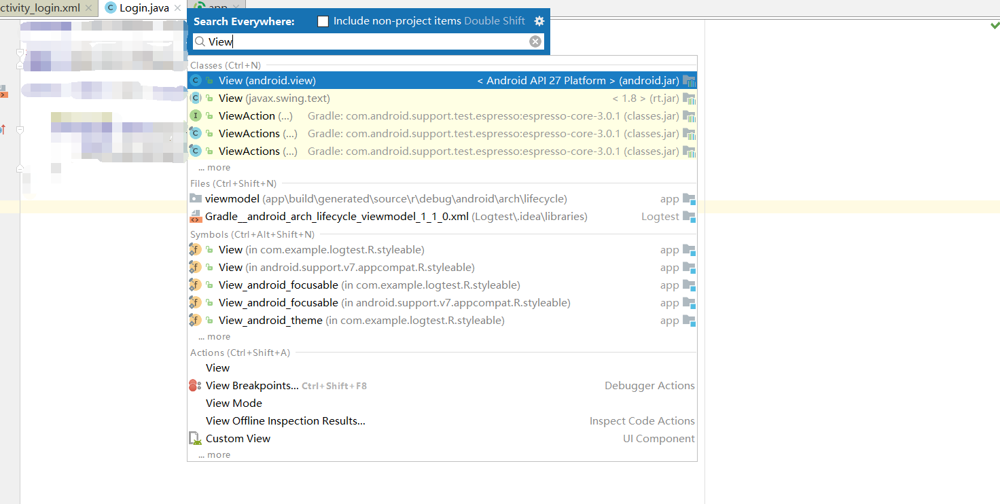

#### ctrl + R：在当前文件范围内查找、替换

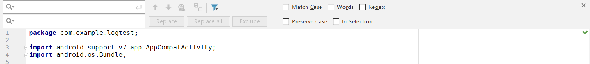

+ **Match Case：匹配大小写**

+ **Words：搜索完整单词（精确搜索）**

+ **Regex：正则表达式**

#### ctrl + N：查找类

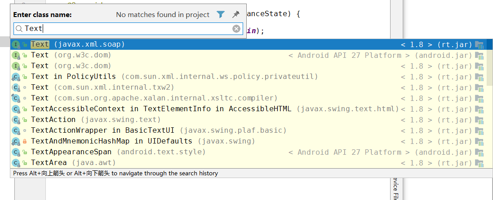

#### ctrl + G：弹出快速定位框

**在框中输入行数，点击OK即可快速切换到对应的行数（Line代表行、column代表列）**

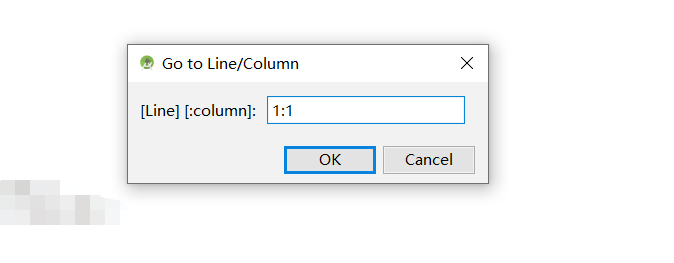

#### ctrl + E：弹出最近打开文件列表

**可以快速选择最近曾经打开的文件**

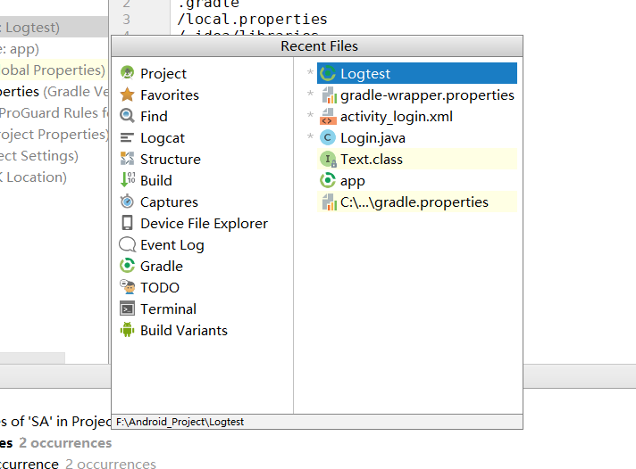

#### ctrl + /：注释一行

#### ctrl + alt + O：自动导包、删除无用的包

#### alt + insert：弹出快速代码生成框

**有构造方法、getter/setter方法、toString方法等**

#### ctrl + F12：查看、查找该类中所有方法

**按下快捷键会显示该类中的所有方法，此时也可输入查找**

#### ctrl + shift + 加号/减号：展开/收起方法

#### ctrl + O：显示所有类的方法

**显示类的方法**，以便重写、重载或实现。

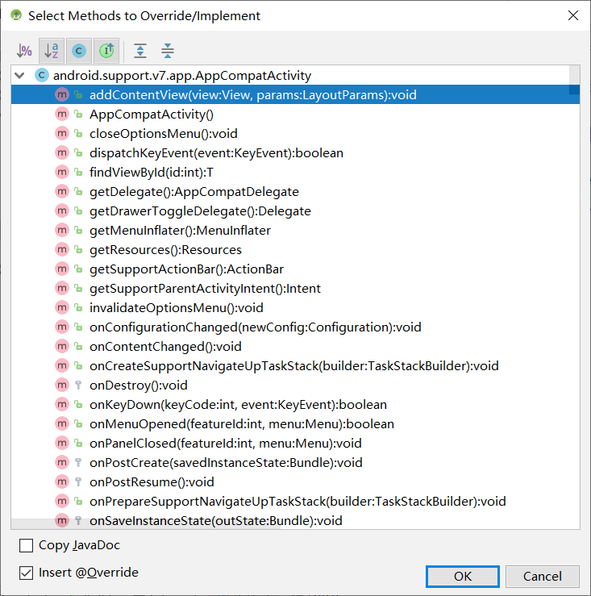

#### ctrl + H：列出类的关系(结构)

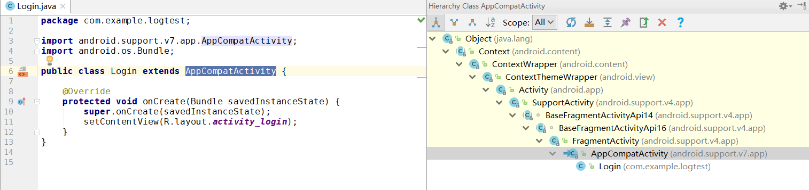

#### 汇总

| 快捷键                   | 功能                       |
| ------------------------ | -------------------------- |
| 双击shift                | 全局搜索                   |
| ctrl + R                 | 在当前文件范围内查找、替换 |
| ctrl + N                 | 查找类                     |
| ctrl + G                 | 弹出快速定位框             |
| ctrl + E                 | 弹出最近打开文件列表       |
| ctrl + /                 | 注释一行                   |
| ctrl + alt + O           | 自动导包、删除无用的包     |
| alt + insert             | 弹出快速代码生成框         |
| ctrl + F12               | 查看、查找该类中所有方法   |
| ctrl + shift + 加号/减号 | 展开/收起方法              |
| ctrl + O                 | 显示所有类的方法           |
| ctrl + H                 | 列出类的关系(结构)         |

### 实用插件

**遇到的问题：**

在安装插件时，遇到了如下图所示报错：

**解决方法：**

将HTTP代理设置为**No proxy**，问题便得以解决。

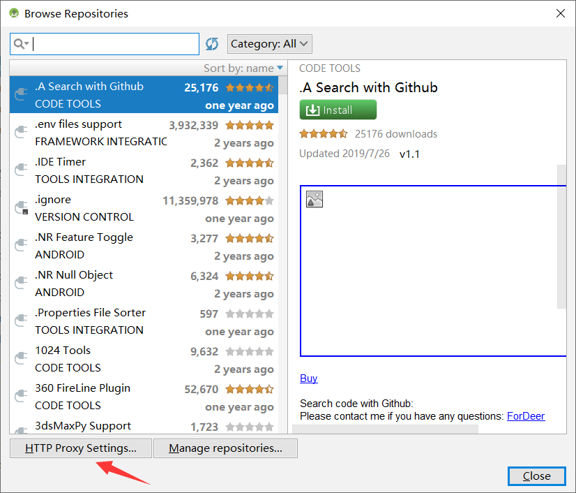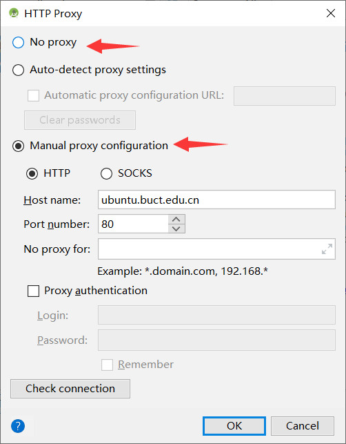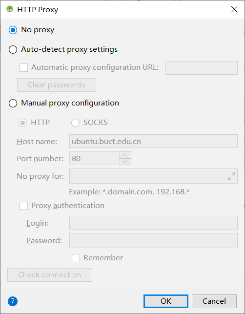

#### GsonFormat

**将 Json 字符串快速转成 JavaBean 对象**

**使用快捷键 alt + s 启用**

+ 在框内输入Json示例后，点击OK

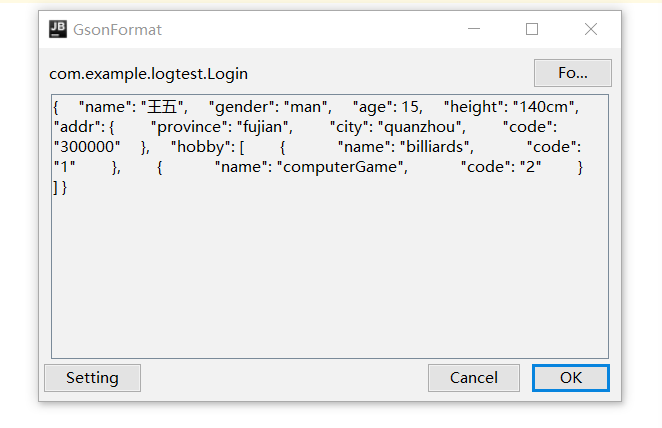

+ 点击OK后，如下图所示，其中Data Type和Field name可检查是否无误并修改

  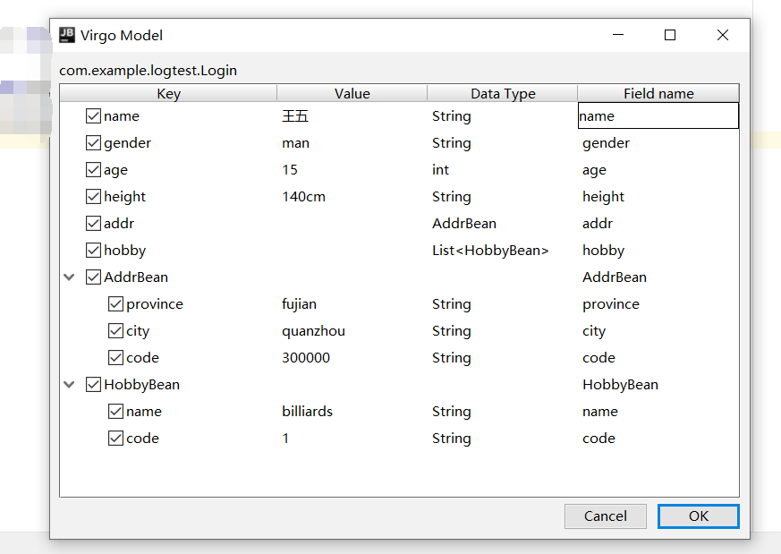

+ 最后会自动生成Json字段对应的JavaBean

  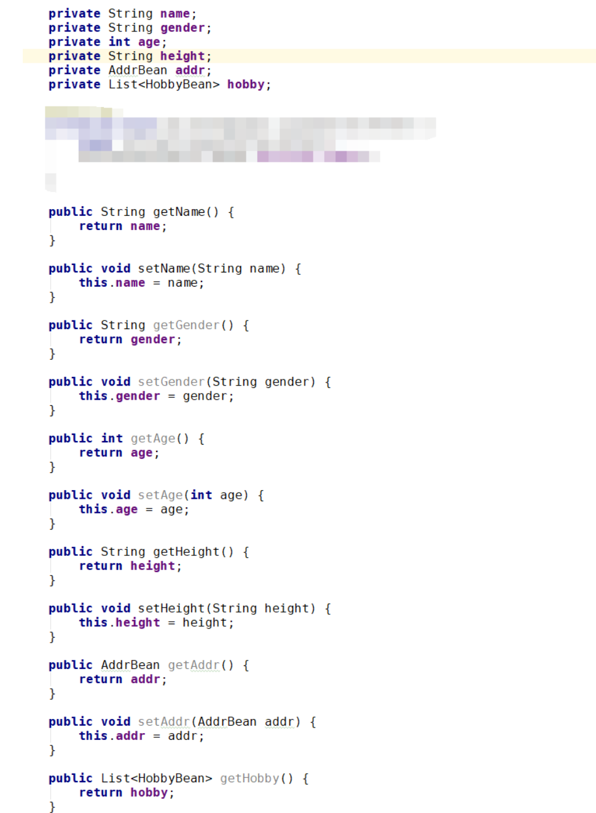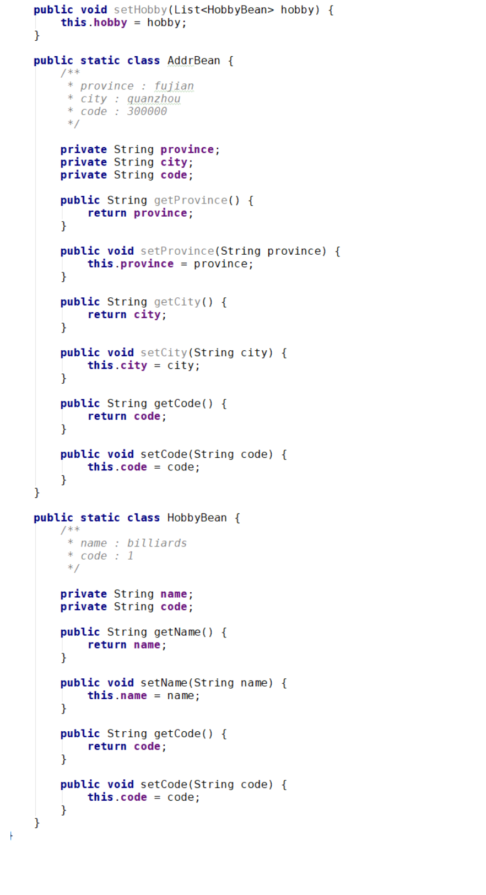

#### Translation

**不过不嫌麻烦的话，个人还是建议查看有道词典中的专业释义（在使用有道词典的过程中，可能出现导致电脑不能复制粘贴的问题，将有道词典重启即可）**

下载该插件后，会出现在Android Studio的右上角，点击会弹出右边所示窗口，在输入框中输入需要翻译的内容即可得到翻译。

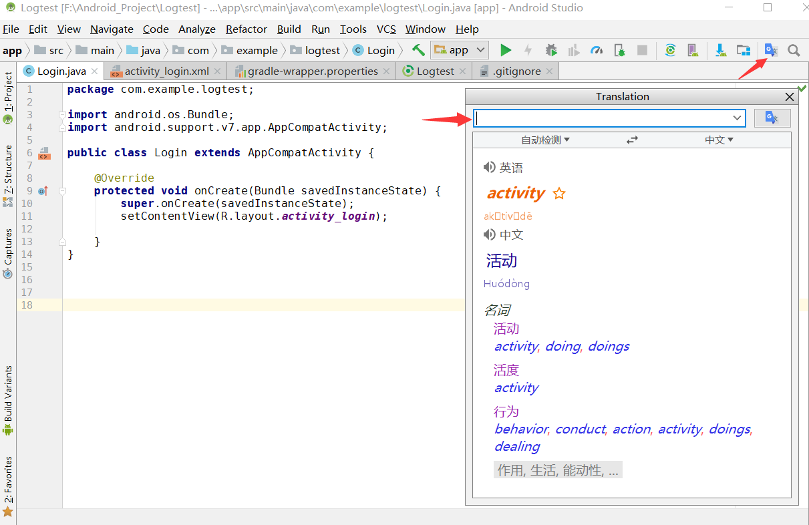