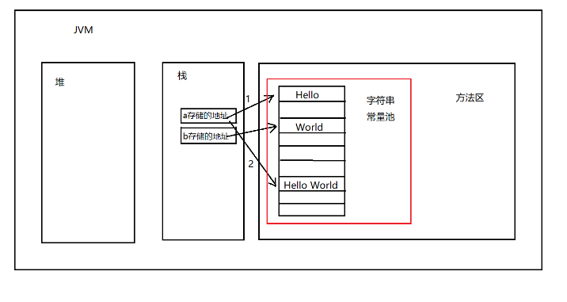
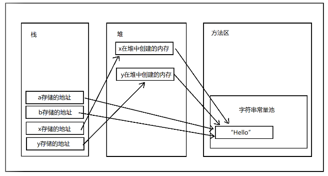

### Java中String类的值在创建后不能修改

在Java中，String类型字符串的值在创建后就不能修改。这个修改是指String对象本身的内容没有改变，因为事实上String对象内容的改变是通过内存地址的改变来完成的。

<!--more-->

```java
String a = "Hello";
String b = "World";
a = a + b;
System.out.println(a);	//Hello World
```

如上输出结果为“Hello World”，实际内存变化如下图所示。第二次的a会在方法区的字符串常量池中重新分配一个内存存放“Hello World”，并存放其内存地址，而之前a存放的内存地址中的Hello不会发生任何变化。



#### 对String类进行扩展说明：

● String类中不同的构造方法在调用时对应在JVM中的操作是不同的。

```java
String a = "Hello";
String b = "Hello";
System.out.println(a == b);	//true

String x = new String("World");
String y = new String("World");
System.out.println(x == y);	//false
```

如上代码中的两个输出结果是不一样的。第一个输出为“true”，第二个输出为“false”。这是因为：

`String a = "Hello";`创建对象时，JVM会首先检查方法区中的字符串常量池中是否存在一个内存空间中存放有“Hello”，没有，故在字符串常量池中分配一个内存空间存放“Hello”；

`String b = "Hello";`创建对象时，方法区中的字符串常量池中已经存在一个内存空间中存放有“Hello”，故直接将字符串常量池中"Hello"的地址返回给b，故a == b，所以第一个输出为true。


`String x = new String("World");`创建对象时，首先会在堆中创建一块内存空间，然后将这个内存的地址返回给x(引用，在栈中)。然后因为“World”是字符串常量，JVM首先会去方法区中的字符串常量池中查看是否存在一个内存空间中存放有“World”，没有，故在字符串常量池中分配一个内存空间存放“World”，并将这个内存空间的地址存入刚刚堆中创建出来的内存空间(对象)中。

`String y = new String("World");`创建对象时，首先会在堆中创建一块内存空间，然后将这个内存的地址返回给y(引用，在栈中)。然后因为“World”是字符串常量，方法区中的字符串常量池中查看已经存在一个内存空间中存放有“World”，故直接将字符串常量池中"World"的地址返回给刚刚堆中创建出来的内存空间(对象)中。

以上文字描述可如下图所示：

