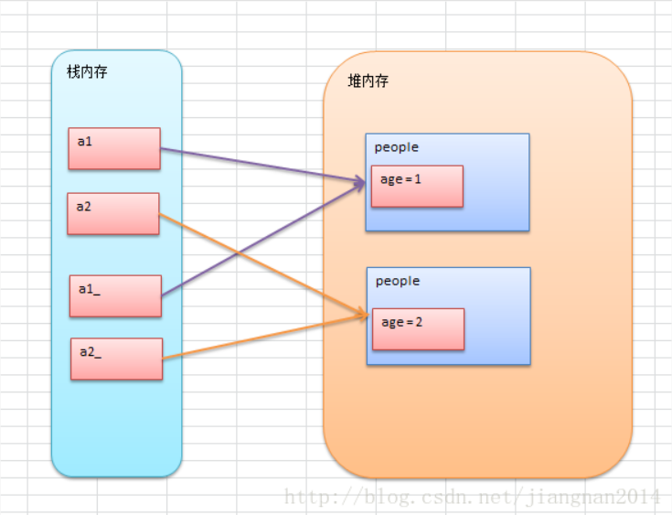

[该文为转载总结](https://blog.csdn.net/jiangnan2014/article/details/22944075)

Java中的方法总是传值的，当方法中传入的是对象时，实际上是传递了对象引用的副本，当在方法中对该对象引用的副本进行修改时，相当于也影响了方法外的实参，但在方法中如果让传入对象引用副本引用了一个新的对象，则之后的改变不会影响到方法外传入的实参。

当方法中传入的是基本数据类型的时候，相当于传递了一个基本数据类型的副本，改变的是该副本的内容，故不会对方法外传入的实参造成影响。

<!--more-->

**Java中引用的使用理解可以类比于C里面的指针的使用。**

eg.

```java
import java.io.Console;
import java.io.File;
import java.io.FileNotFoundException;
import java.io.PrintWriter;
import java.util.*; 
 
class People
{   
	public int age;  
	public static void Swap(People a1, People a2)
	{     
		People tem;   
		tem = a1;    
		a1 = a2;     
		a2 = tem; 
	}  
	public static void Change(People a1, People a2)
	{      
		a1.age = 250;  
		a2.age = 250;   
	}
}
public class Empty
{ 
	public static void main(String[]args)    
	{        
		People a1 = new People();    
		People a2 = new People();  
		a1.age = 1;  
		a2.age = 2;  
		
		//这里没能交换，看起来是按值传递       
		People.Swap(a1, a2);      
		System.out.printf("%d \t %d", a1.age, a2.age);             
		System.out.println();  
		
		//这里修改了变量，看起来是按引用传递        People.Change(a1, a2);    
		System.out.printf("%d \t %d", a1.age, a2.age); 
	}
}
```



看上图，方法的参数可以看做是另一个变量:a1_和a2_
它们只是和传入参数拥有相同的对象地址而已；
对于交换对象也只是对a1_和a2_这两个做交换罢了，不会影响a1，a2；
但如果是通过内存地址去修改对象内部，如改变age的值，则会影响a1,a2；

eg.方法中传入数组，想在方法中对数组进行一些改动，但不影响到方法外的实参，则只能在方法中for循环拷贝一份数组。

