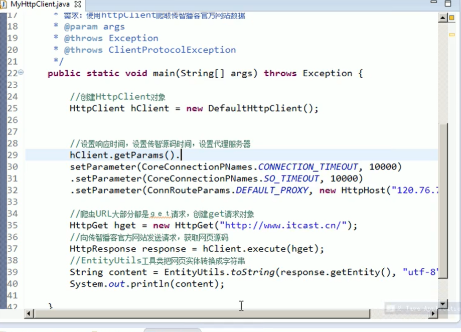

### 一：使用okhttp3发送无参GET请求

**爬虫**：模拟浏览器的url请求向服务器发送请求并获得返回。

**在网上下载使用okhttp3所需要的jar包：**

okio-2.7.0.jar；okhttp-4.8.0.jar；kotlin-stdlib-1.3.11.jar;    (版本可变)

在IJ中创建一般项目后导入三个jar包([导包教程](https://jingyan.baidu.com/article/b0b63dbfe25df24a483070a1.html))

<!--more-->

```java
//示例：通过向网站(其网址为url)发送
import java.io.IOException;
import okhttp3.OkHttpClient;
import okhttp3.Request;
import okhttp3.Response;

public class GetExample {
    OkHttpClient client = new OkHttpClient();    //创建okHttpClient对象

    String run(String url) throws IOException {
        Request request = new Request.Builder()      //创建Request对象构建请求消息     
                .url(url)
                .build();

        try (Response response = client.newCall(request).execute()) {  //通过client的newCall().ececute()传入请                                                                       //求消息并通过Response对象接受返回的响应消息
            return response.body().string();   //将Response接受的响应消息体通过字符串形式返回
        }
    }

    public static void main(String[] args) throws IOException {
        GetExample example = new GetExample();
        String response = example.run("url");
        System.out.println(response);
    }
}
```

代码中出现的Request.Builder().url(url).build();的用法如不了解可参考：[设计模式之建造者模式](https://blog.csdn.net/bingjianit/article/details/53607856)


**Java的网络通信:**

服务器端通过ServerSocket建立监听，客户端通过Socket连接到指定服务器后，通信双方就可以通过IO流进行通信。


**Socket** ：

一个Socket就是由IP地址和端口号（范围是0～65535）组成。端口号总是由操作系统分配，它是一个0～65535之间的数字，其中，小于1024的端口属于*特权端口*，需要管理员权限，大于1024的端口可以由任意用户的应用程序打开。

- 对服务器端来说，它的Socket是指定的IP地址和指定的端口号；

- 对客户端来说，它的Socket是它所在计算机的IP地址和一个由操作系统分配的随机端口号

  

**浏览器登录后发起请求（携带Cookie发请求）**

浏览器的工作:

1请求一个需要登录的页面或资源  

2服务器判断当前的会话是否包含已登录信息。如果没有登录重定向到登录页面  

3手工在登录页面录入正确的账户信息并提交 

4服务器判断登录信息是否正确，如果正确则将登录成功信息保存到session中  

5登录成功后服务器端给浏览器返回会话的SessionID信息保存到客户端的Cookie中  

6浏览器自动跳转到之前的请求地址并携带之前的Cookie（包含登录成功的SessionID）  

7服务器端判断session中是否有成功登录信息，如果有则将请求的资源反馈给浏览器


**JSON**

JSON是JavaScript Object Notation的缩写，它去除了所有JavaScript执行代码，只保留JavaScript的对象格式。


HttpClirnt:



